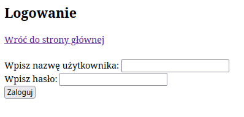
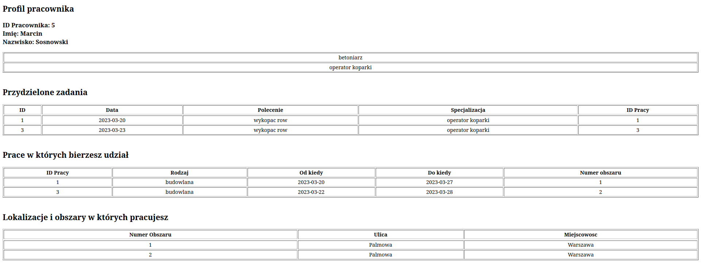
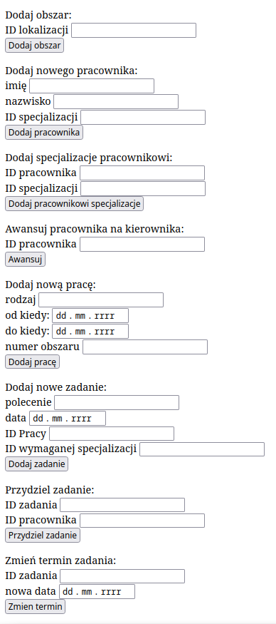

# Ogród zoologiczny - opis przyjętego rozwiązania

Wejście na stronę logowania do strony ogrodu znajduje się na: https://students.mimuw.edu.pl/~zg417609/bd.php

## Strona logowania



Na stronę ogrodu możemy się zalogować albo jako zwykły pracownik, albo jako kierownik.

W zależności od ID pracownika logujemy się:  
```
login: User{numer ID}
hasło: PassU{numer ID}
```
W tej chwili jako kierownik jest ustawiony User1.

Tak wygląda domyślne hasło nowego pracownika, pracownik po po swoim pierwszym logowaniu może (a nawet powinien) zmienić hasło.


Pracownik ma dostęp tylko do informacji o pracach, w których bierze udział. 

## Profil pracownika



Natomiast kierownik może przeglądać i modyfikować bazę danych, ma również dostęp do profilu pracownika, którym również jest.


Dalej dostępne są formularze, dzięki którym kierownik może zmieniać, dodawać dane do bazy, tzn. przydzielać zadania, dodawać nowych pracowników, nowe zadania itd.

## Formularze dostępne dla kierownika



Uwzględnione zostały ograniczenia:
- może być co najwyżej 50 pracowników
- zadania wykonywane w ciągu jednego dnia
- dla każdej pracy na jeden dzień przypada jedno zadanie (w ramach pracy wykonywane po kolei, tzn. nie są wykonywane jednocześnie)
- pracownik może wykonywać tylko jedno zadanie dziennie
- każdy pracownik musi mieć jedną lub więcej specjalności
- zmienianie daty przydzielonego zadania uwzględnia kolizje pracowników

Jeżeli wprowadzenie nowych danych lub zmiana starych nie jest możliwa np. ze względu na ograniczenia czy poprawność wprowadzanych danych pojawi się błąd.
```
Error executing query!
```